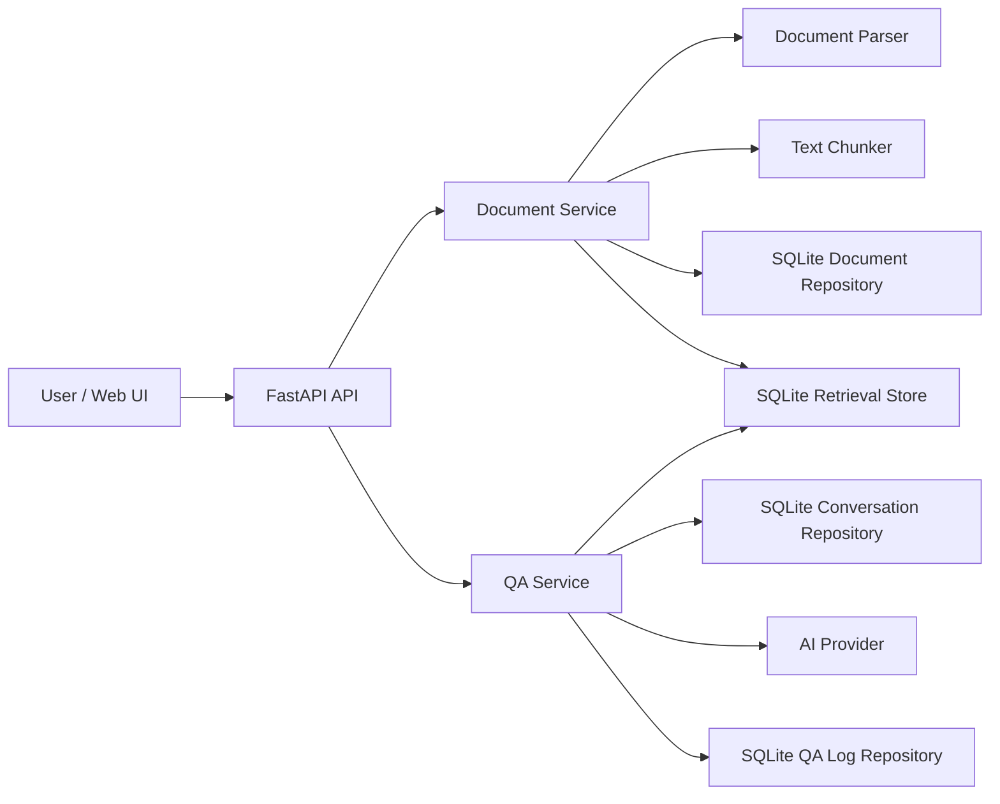

# Architecture Design

This document describes the current architecture of the Document Q&A System. The system is a small RAG-style application: users upload documents, the backend parses and indexes them, and the chat endpoint answers questions using retrieved document context plus recent conversation history.

## Goals

- Provide a simple Web UI for uploading documents, managing documents, browsing conversations, and asking questions.
- Support common document formats: `.txt`, `.md`, `.markdown`, `.pdf`, `.doc`, and `.docx`.
- Keep the MVP easy to run with Docker and SQLite.
- Allow different AI providers without changing API routes or UI code.
- Persist uploaded files, parsed chunks, retrieval data, QA logs, and conversation history locally.

## High-Level Flow



## Runtime Components

### Web UI

The frontend is served from `src/document_qa/web/` by the same FastAPI process:

- `index.html`: application shell.
- `app.js`: document upload/list/delete, conversation list loading, chat interaction, Markdown answer rendering, loading states, and tab switching.
- `styles.css`: responsive workspace layout, document/conversation tabs, scrollable lists, and chat presentation.

The UI calls the backend under the configured API prefix, `/api` by default.

### FastAPI Application

`src/document_qa/main.py` creates the app and wires dependencies into `app.state`:

- Settings from `document_qa.core.config`.
- SQLite repositories for documents, QA logs, and conversations.
- SQLite retrieval store.
- Document service.
- QA service.
- Configured AI provider.

On startup, repositories are initialized and the retrieval store rebuilds from persisted chunks.

### Document Ingestion

Document ingestion is handled by `DocumentService`:

1. Validate the file extension.
2. Read the upload with `MAX_UPLOAD_BYTES + 1` to enforce size limits.
3. Parse the document into plain text.
4. Store the original source file under `STORAGE_DIR`.
5. Split parsed text into overlapping chunks.
6. Persist document metadata and chunks in SQLite.
7. Upsert chunks into the retrieval store.

Supported extensions are:

| Extension | Internal type | Parser behavior |
| --- | --- | --- |
| `.txt` | `txt` | UTF-8 text decode |
| `.md`, `.markdown` | `markdown` | UTF-8 decode plus simple Markdown-to-text cleanup |
| `.pdf` | `pdf` | Text extraction with `pypdf` |
| `.docx` | `docx` | Paragraph/table extraction with `python-docx` |
| `.doc` | `doc` | Legacy Word via `antiword`, plus fallbacks for renamed `.docx`, RTF, HTML/text-like files, and LibreOffice conversion when available |

### Retrieval

The current retrieval store is SQLite-backed and local. It indexes parsed chunks and performs token-overlap search with a configurable minimum score:

- `CHUNK_SIZE`: default `1000`.
- `CHUNK_OVERLAP`: default `200`.
- `RETRIEVAL_MIN_SCORE`: default `0.015`.
- Retrieval limit in `QAService`: currently `5`.

This boundary is intentionally isolated in `document_qa.retrieval.vector_store`, so it can later be replaced by a vector database or embedding-backed search without changing API routes.

### QA And Conversation Flow

The chat flow is handled by `QAService`:

1. Normalize the question.
2. Create or reuse a conversation.
3. Load recent conversation messages.
4. Retrieve relevant document chunks.
5. If no question or no relevant chunks are available, return a friendly insufficient-context answer.
6. Build a provider prompt from conversation history and document context.
7. Call the configured AI provider.
8. Persist the QA log.
9. Append both user and assistant messages to the conversation.
10. Return the answer, retrieved chunk ids, log id, and conversation id.

Conversation context is controlled by `CONVERSATION_HISTORY_LIMIT`, default `20`.

### AI Provider Layer

All providers implement a single interface:

```python
class AIProvider(Protocol):
    def generate_answer(self, prompt: ProviderPrompt) -> str:
        ...
```

Supported `AI_PROVIDER` values:

| Provider | Value | Required settings |
| --- | --- | --- |
| Fake deterministic provider | `fake` | None |
| OpenAI | `openai` | `OPENAI_API_KEY`, optional `OPENAI_MODEL` |
| DeepSeek | `deepseek` | `DEEPSEEK_API_KEY`, optional `DEEPSEEK_MODEL`, `DEEPSEEK_BASE_URL` |
| OpenAI-compatible endpoint | `openai_compatible`, `openai-compatible` | `OPENAI_COMPATIBLE_BASE_URL`, optional key/model |
| Anthropic Claude | `anthropic`, `claude` | `ANTHROPIC_API_KEY`, optional model/base URL |
| Ollama/local | `ollama`, `local` | `OLLAMA_MODEL`, `OLLAMA_BASE_URL` |

Provider failures are converted to `AIProviderError` and returned by the chat route as `503 Service Unavailable`.

## Persistence Design

SQLite is the only database in the current implementation. The configured path is `DATABASE_PATH`, default `.data/document_qa.sqlite3`.

Persisted data includes:

- Document metadata.
- Parsed document chunks.
- Retrieval index rows.
- QA logs.
- Conversation summaries.
- Ordered conversation messages.

Uploaded source files are stored separately under `STORAGE_DIR`, default `.data/uploads`.

Deleting a document removes:

- Document metadata.
- Persisted chunks.
- Retrieval index entries.
- Stored source file.

It does not delete historical conversation messages that may have referenced previous answers.

## Configuration

Configuration is environment-driven. See `.env.example` for defaults.

Important settings:

| Variable | Default | Purpose |
| --- | --- | --- |
| `APP_ENV` | `local` | Environment label returned by health checks |
| `API_PREFIX` | `/api` | API route prefix |
| `STORAGE_DIR` | `.data/uploads` | Uploaded source file location |
| `DATABASE_PATH` | `.data/document_qa.sqlite3` | SQLite database path |
| `MAX_UPLOAD_BYTES` | `20971520` | Upload size limit, 20 MB by default |
| `CHUNK_SIZE` | `1000` | Text chunk size |
| `CHUNK_OVERLAP` | `200` | Chunk overlap |
| `RETRIEVAL_MIN_SCORE` | `0.015` | Minimum retrieval score |
| `CONVERSATION_HISTORY_LIMIT` | `20` | Number of recent messages sent as context |
| `AI_PROVIDER` | `fake` | Active model provider |
| `AI_REQUEST_TIMEOUT_SECONDS` | `30` | Provider request timeout |

## Deployment Shape

The simplest deployment is Docker Compose:

```bash
cp .env.example .env
docker compose up --build
```

The FastAPI service exposes both:

- Web UI: `http://localhost:8000/`
- API: `http://localhost:8000/api/...`

The application is designed for local/small-team use. For production usage, the next likely changes are authentication, rate limits, background ingestion jobs, a real vector index, object storage for uploads, and database migrations.
