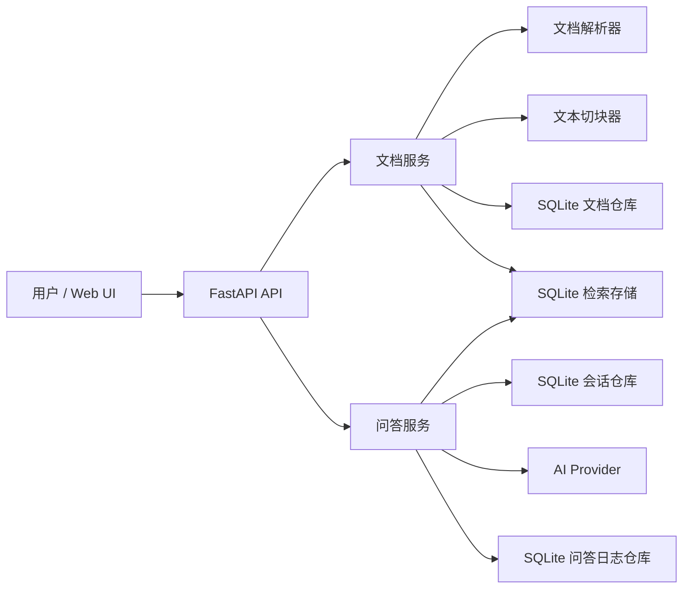

# 架构设计

本文档说明 Document Q&A System 当前的系统架构。这个项目是一个轻量级 RAG 文档问答应用：用户上传文档，后端解析并建立本地检索索引，聊天接口基于检索到的文档上下文和最近会话历史生成回答。

## 设计目标

- 提供一个简单的 Web UI，用于上传文档、管理文档、浏览会话和提问。
- 支持常见文档格式：`.txt`、`.md`、`.markdown`、`.pdf`、`.doc`、`.docx`。
- 使用 Docker 和 SQLite 保持本地启动成本低。
- 支持切换不同 AI 服务提供方，并且不影响 API 路由和前端代码。
- 本地持久化上传文件、解析后的文本块、检索数据、问答日志和会话历史。

## 总体流程



## 运行时组件

### Web UI

前端文件位于 `src/document_qa/web/`，由同一个 FastAPI 进程提供静态资源：

- `index.html`：页面结构。
- `app.js`：文档上传、文档列表、删除文档、加载会话列表、聊天交互、Markdown 回答渲染、加载状态和 tab 切换。
- `styles.css`：响应式工作区布局、文档/会话 tab、列表滚动和聊天样式。

前端默认调用 `/api` 前缀下的后端接口。这个前缀可以通过 `API_PREFIX` 配置。

### FastAPI 应用

`src/document_qa/main.py` 创建应用，并把依赖挂载到 `app.state`：

- 来自 `document_qa.core.config` 的配置。
- 文档、问答日志、会话的 SQLite 仓库。
- SQLite 检索存储。
- 文档服务。
- 问答服务。
- 当前配置的 AI Provider。

应用启动时会初始化 SQLite 表，并从已持久化的文档 chunks 重建检索索引。

### 文档摄取流程

文档上传由 `DocumentService` 处理：

1. 校验文件扩展名。
2. 按 `MAX_UPLOAD_BYTES + 1` 读取上传内容，用于判断是否超过大小限制。
3. 将文档解析为纯文本。
4. 将原始文件保存到 `STORAGE_DIR`。
5. 将解析文本切成带 overlap 的 chunks。
6. 将文档元数据和 chunks 写入 SQLite。
7. 将 chunks 写入检索存储。

支持的文件类型：

| 扩展名 | 内部类型 | 解析方式 |
| --- | --- | --- |
| `.txt` | `txt` | UTF-8 文本解码 |
| `.md`, `.markdown` | `markdown` | UTF-8 解码，并做简单 Markdown 转纯文本处理 |
| `.pdf` | `pdf` | 使用 `pypdf` 提取文本 |
| `.docx` | `docx` | 使用 `python-docx` 提取段落和表格文本 |
| `.doc` | `doc` | 优先使用 `antiword` 解析旧版 Word；同时支持重命名的 `.docx`、RTF、HTML/文本类文件，以及可用时的 LibreOffice 转换兜底 |

### 检索

当前检索存储是本地 SQLite 实现。它索引解析后的文本块，并基于 token overlap 做相关性搜索：

- `CHUNK_SIZE`：默认 `1000`。
- `CHUNK_OVERLAP`：默认 `200`。
- `RETRIEVAL_MIN_SCORE`：默认 `0.015`。
- `QAService` 当前检索数量上限：`5`。

检索边界集中在 `document_qa.retrieval.vector_store`。后续如果要替换成向量数据库或 embedding 检索，可以优先替换这一层，而不需要改 API 路由。

### 问答和会话流程

聊天问答由 `QAService` 处理：

1. 规范化用户问题。
2. 创建新会话或复用已有会话。
3. 加载最近的会话消息。
4. 检索相关文档 chunks。
5. 如果问题为空或没有检索到足够相关内容，返回“上下文不足”的友好提示。
6. 基于会话历史和文档上下文组装 provider prompt。
7. 调用当前配置的 AI Provider。
8. 持久化问答日志。
9. 将用户消息和 assistant 回答追加到会话。
10. 返回回答、命中的 chunk id、日志 id 和会话 id。

会话上下文窗口由 `CONVERSATION_HISTORY_LIMIT` 控制，默认保留最近 `20` 条消息。

### AI Provider 层

所有模型服务都实现同一个接口：

```python
class AIProvider(Protocol):
    def generate_answer(self, prompt: ProviderPrompt) -> str:
        ...
```

支持的 `AI_PROVIDER`：

| 服务 | 配置值 | 必要配置 |
| --- | --- | --- |
| 本地假数据 provider | `fake` | 无 |
| OpenAI | `openai` | `OPENAI_API_KEY`，可选 `OPENAI_MODEL` |
| DeepSeek | `deepseek` | `DEEPSEEK_API_KEY`，可选 `DEEPSEEK_MODEL`、`DEEPSEEK_BASE_URL` |
| OpenAI-compatible 服务 | `openai_compatible`, `openai-compatible` | `OPENAI_COMPATIBLE_BASE_URL`，可选 key/model |
| Anthropic Claude | `anthropic`, `claude` | `ANTHROPIC_API_KEY`，可选 model/base URL |
| Ollama/本地模型 | `ollama`, `local` | `OLLAMA_MODEL`、`OLLAMA_BASE_URL` |

Provider 调用失败会转换成 `AIProviderError`，聊天接口会返回 `503 Service Unavailable`。

## 持久化设计

当前实现只使用 SQLite。数据库路径由 `DATABASE_PATH` 配置，默认是 `.data/document_qa.sqlite3`。

持久化的数据包括：

- 文档元数据。
- 解析后的文档 chunks。
- 检索索引数据。
- 问答日志。
- 会话摘要。
- 按顺序保存的会话消息。

上传的原始文件单独保存在 `STORAGE_DIR`，默认是 `.data/uploads`。

删除文档会移除：

- 文档元数据。
- 持久化 chunks。
- 检索索引条目。
- 原始上传文件。

删除文档不会删除历史会话消息。历史会话里曾经回答过的内容会继续保留。

## 配置

系统通过环境变量配置。完整默认值见 `.env.example`。

关键配置：

| 变量 | 默认值 | 说明 |
| --- | --- | --- |
| `APP_ENV` | `local` | 环境标识，健康检查会返回 |
| `API_PREFIX` | `/api` | API 路由前缀 |
| `STORAGE_DIR` | `.data/uploads` | 上传原始文件保存目录 |
| `DATABASE_PATH` | `.data/document_qa.sqlite3` | SQLite 数据库路径 |
| `MAX_UPLOAD_BYTES` | `20971520` | 上传大小限制，默认 20 MB |
| `CHUNK_SIZE` | `1000` | 文本块大小 |
| `CHUNK_OVERLAP` | `200` | 文本块 overlap |
| `RETRIEVAL_MIN_SCORE` | `0.015` | 检索最小相关性分数 |
| `CONVERSATION_HISTORY_LIMIT` | `20` | 发送给模型的最近会话消息数量 |
| `AI_PROVIDER` | `fake` | 当前启用的模型服务 |
| `AI_REQUEST_TIMEOUT_SECONDS` | `30` | 模型服务请求超时时间 |

## 部署形态

最简单的启动方式是 Docker Compose：

```bash
cp .env.example .env
docker compose up --build
```

FastAPI 服务同时提供：

- Web UI：`http://localhost:8000/`
- API：`http://localhost:8000/api/...`

当前系统更适合本地或小团队使用。如果要用于生产环境，优先需要补充认证、限流、后台异步摄取任务、真正的向量索引、对象存储和数据库迁移能力。
